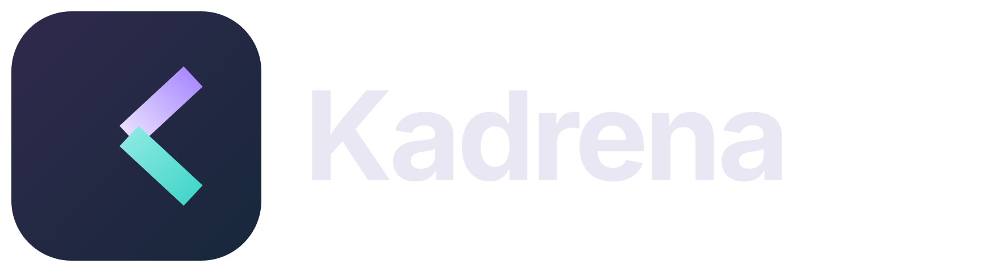

# Kadrena

<p align="center"></p>

**macOS, iPhone ve iPad için yerel video düzenleyici.** Arda Çobanoğlu tarafından Codex ile geliştirilir. Yerel videoları bir zaman çizelgesinde düzenlemek, ses eklemek ve sonucu dışa aktarmak için hazırlanmıştır.

## Platformlar ve durum

| Platform | Gereksinim | Kayda geçmiş doğrulama |
| --- | --- | --- |
| macOS | macOS 13+, Apple Silicon | Uygulama açılışı, düzenleme ve örnek dışa aktarmalar |
| iPhone / iPad | iOS/iPadOS 17+, Xcode | Simülatör ve cihaz hedefi derlemeleri; iPhone'da kurulum ve açılış |

Bu depo mevcut kaynakların ilk GitHub aktarımıdır. Geliştirme sohbetlerindeki teslimler yayımlanmış GitHub sürümleri veya mağaza yayını değildir. Önceki Git geçmişi üretilmemiştir.

## Özellikler

- Yerel video ve ses ekleme; iOS'ta Dosyalar veya Fotoğraflar'dan video seçme.
- Video ve sesi ayrı zaman çizelgesi izlerinde düzenleme.
- Zaman cetveline tıklayarak/dokunarak oynatma konumunu seçme.
- Klipleri sürükleyerek taşıma, kenarlarından kırpma, imleçte bölme ve silme.
- Zaman çizelgesini yakınlaştırarak hassas düzenleme.
- Kaynak oranını koruma; **9:16, 16:9, 4:3, 1:1 ve 21:9** tuval seçenekleri.
- Ses düzeyi, giriş/çıkış soldurması ve özgün video sesi denetimi.
- Video sonunda siyaha kararma; önizleme ve çıktı üzerinde uygulama.
- Tam ekran önizleme ve kare kare gezinme.
- Koyu/açık görünüm, kare hızı ve çıktı kalitesi ayarları.
- JSON proje kaydetme/açma.
- **MP4, MOV ve M4V** dışa aktarma; iOS'ta çıktı paylaşma menüsü.

## Hızlı kullanım

1. Video kliplerini içe aktarın, gerekiyorsa ayrı ses/müzik ekleyin.
2. Tuval oranını seçin. Dikey videoyu özgün oranında tutmak için **Kaynak** kullanın.
3. Zaman çizelgesinde konum seçin; klipleri taşıyın, kenardan kırpın veya bölün.
4. Ses düzeylerini ve soldurma sürelerini ayarlayın.
5. Projeyi kaydedin; önizleyin ve çıktı biçimini seçerek dışa aktarın.

### Kısayollar

| İşlem | Kısayol |
| --- | --- |
| Oynat / duraklat | Space |
| Seçili klibi böl | ⌘B |
| Sil | Delete (macOS) |
| Tam ekran önizleme | ⇧⌘F |
| Kare kare ilerleme | Sol / sağ ok (macOS) |
| Dışa aktarma | ⌘E |

iOS harici klavye desteğinde ⌘O, ⌘L, ⌘S, ⌘B, ⌘E, ⇧⌘F ve Space bulunur. Diğer kısayollar için uygulama menüsünü inceleyin.

## Kaynaktan çalıştırma

### macOS

Xcode Command Line Tools kurulu bir Apple Silicon Mac'te:

```sh
bash scripts/build-macos.sh
open outputs/Kadrena.app
```

Bu betik macOS 13 hedefli yerel geliştirme paketi oluşturur ve ad-hoc imzalar; Apple Developer dağıtım imzası/notarization yapmaz.

### iPhone ve iPad

1. `ios/KadrenaIOS.xcodeproj` projesini Xcode'da açın.
2. Hedef cihazı veya simülatörü seçin.
3. Fiziksel cihaz için **Signing & Capabilities** altında kendi takımınızı ve gerekirse benzersiz bundle identifier'ınızı seçin.
4. **Run** ile derleyip çalıştırın. Kaynaklar geliştirme sırasında Xcode 27 ile derlenmiştir.

## Proje dosyası ve medya

JSON proje dosyası kaynak videoları/sesleri içine gömmez. macOS'ta kaynakları mevcut konumlarında tutun. iOS seçilen medyayı uygulamanın Medya klasörüne kopyalar; proje bu uygulama kurulumundaki dosyalara başvurur. Yalnız JSON dosyasını başka cihaza göndermek tam proje aktarımı değildir.

## Biçim kapsamı ve sınırlar

Giriş/çıkış desteği **AVFoundation** ve işletim sistemi kodeklerine bağlıdır. İlk istekteki “her video biçimi” hedefi tamamlanmış değildir. Mevcut çıktı biçimleri MP4/MOV/M4V ile sınırlıdır; FFmpeg tabanlı geniş kapsam bu kaynakta yoktur.

## Depo yapısı

- `macos/`: SwiftUI/AVFoundation masaüstü uygulaması ve plist.
- `ios/`: mobil arayüz, kurgu modeli, Xcode projesi ve görsel varlıklar.
- `assets/`: logo ve uygulama simgesi.
- `scripts/`: macOS geliştirme derleme betiği.
- `docs/`: sohbetlerden derlenen gelişim geçmişi ve doğrulama sınırları.

[Geliştirme geçmişi](docs/DEVELOPMENT-HISTORY.md) · [Doğrulama kaydı](docs/VALIDATION.md)

## Lisans

Bu aktarımda açık kaynak lisansı seçilmemiştir. Kaynağa erişim, yeniden dağıtım veya ticari kullanım için otomatik lisans izni anlamına gelmez.
